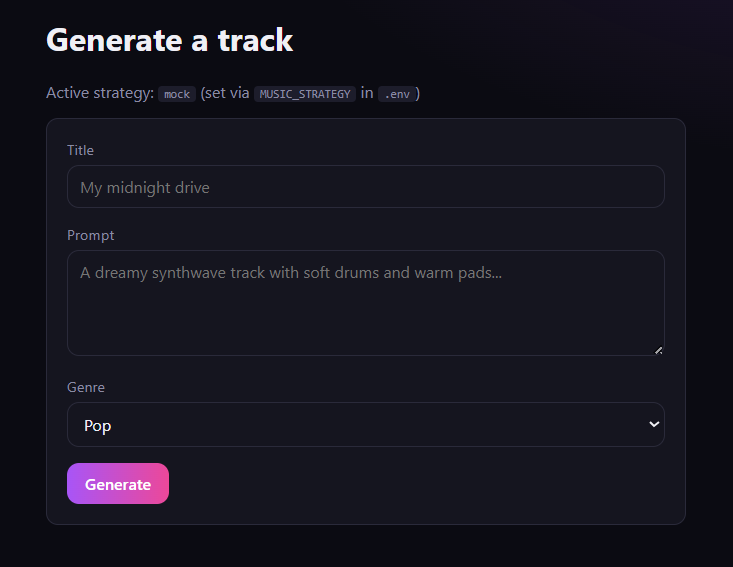
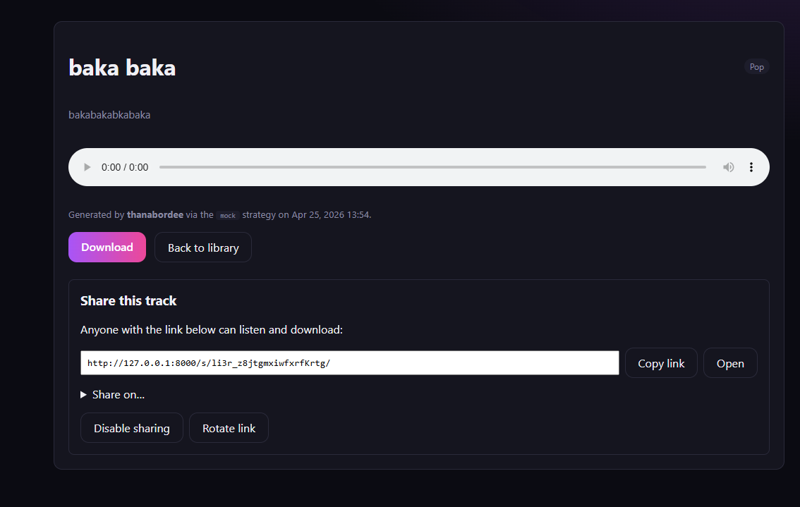
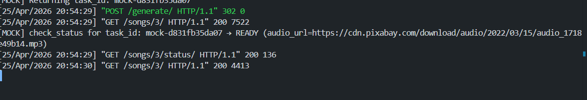
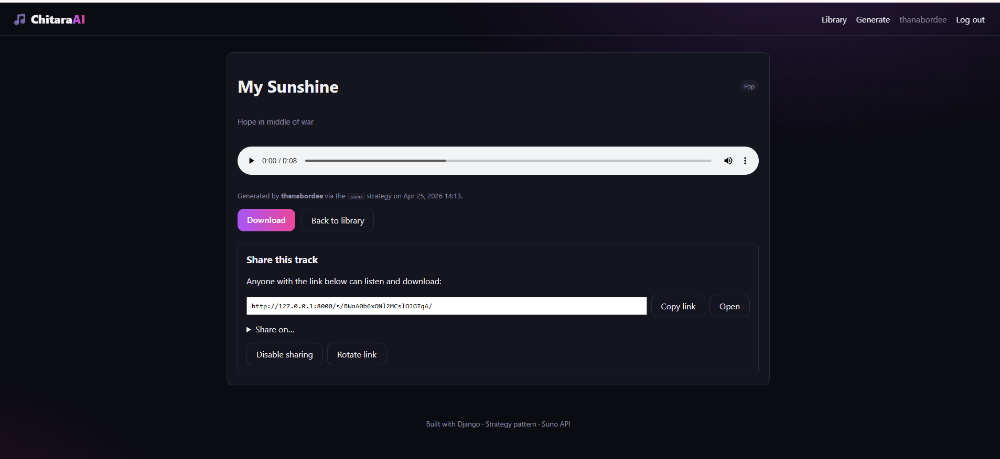
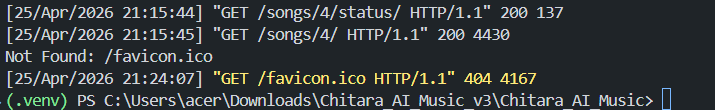

# 🎵 Chitara_AI_Music

> **v3 — what's new**
> - **sunoapi.org integration**: SunoStrategy rewritten for the sunoapi.org
>   gateway (`POST /api/v1/generate`, `GET /api/v1/generate/record-info`).
>   Default `SUNO_API_BASE` is now `https://api.sunoapi.org`.
> - **Async generation with live progress**: clicking "Generate" now
>   redirects you immediately to the song page, which polls a JSON status
>   endpoint and shows a progress bar (10% → 40% → 80% → 100%).
> - **Browser notifications**: when generation finishes (or fails) you get
>   a desktop notification, the tab title flashes, and the audio player
>   auto-loads — even if you switched tabs.
> - **Friendly error surfacing**: 503/Not Found/credit-exhausted errors
>   from the upstream provider are parsed and displayed cleanly instead of
>   leaking raw HTML / JSON blobs into the UI.
>
> **Migration step:** after pulling, run `python manage.py migrate` to
> apply `0003_song_async_status` (adds `status`, `task_id`, `error_message`
> to the Song model).


A Django web app that generates AI music from a text prompt. Users sign in
(email or **Google**), describe the track they want, pick a **genre**, and
get back a playable + downloadable song. Generation is pluggable via the
**Strategy pattern** — flip between a fully offline **Mock** backend and the
real **Suno** API by changing one line in `.env`.

---

## Table of contents

1. [Features](#features)
2. [Quick start](#quick-start)
3. [Configuration (`.env`)](#configuration-env)
4. [Google login setup](#google-login-setup)
5. [Switching to the real Suno API](#switching-to-the-real-suno-api)
6. [Architecture & the Strategy pattern](#architecture--the-strategy-pattern)
7. [Design Q&A](#design-qa)
8. [Project layout](#project-layout)
9. [Running tests](#running-tests)

---

## Features

- 🎙️ **Generate music from a prompt** + selected genre
- 🎚️ **Filter library by genre** (Pop, Rock, Jazz, Classical, Hip-Hop, Electronic, Lo-Fi, Ambient)
- ⬇️ **Download** every generated song (works for both local files and remote Suno URLs — the server proxies the download as an attachment)
- 🔗 **Share songs via public link** — each song gets an opaque, unguessable share token (`/s/<token>/`); owners can toggle sharing on/off and rotate the token to invalidate old links
- 🔌 **Strategy pattern** for generation backends — `Mock` and `Suno` ship out of the box, adding more (Udio, Riffusion, local Diffusion model) is one new file
- 🔐 **Authentication** via Django + `django-allauth`, including **Google OAuth**
- 🎨 Dark, gradient-accent UI with no external CSS framework

### Sharing model in one paragraph

Every `Song` row carries an `is_public` flag (default `True`) and a 22-char URL-safe `share_token` generated with `secrets.token_urlsafe`. The public route `/s/<token>/` resolves songs by that opaque token rather than the numeric primary key, so song IDs are not enumerable from share URLs. The owner can flip `is_public` off (link returns 403) or rotate the token (old link 404s, new one is minted). Public download (`/s/<token>/download/`) reuses the same proxy logic as the authenticated download, so Suno-hosted audio is streamed through your server. After pulling this update, run `python manage.py migrate` to apply migration `0002_song_sharing` which adds `is_public` + `share_token` and backfills tokens for existing rows.

---

## Quick start

> Tested with **Python 3.10+**.

```bash
# 1. Clone / unzip the project, then:
cd Chitara_AI_Music

# 2. Create + activate a virtual env
python -m venv .venv
source .venv/bin/activate          # Windows: .venv\Scripts\activate

# 3. Install dependencies
pip install -r requirements.txt

# 4. Copy the example env file and edit it
cp .env.example .env                # Windows: copy .env.example .env

# 5. Apply migrations + create a superuser (optional, for /admin)
python manage.py migrate
python manage.py createsuperuser

# 6. Run the server
python manage.py runserver
```

Open <http://127.0.0.1:8000>.

The app starts in **mock mode** out of the box — you can sign up with
email/password and generate songs immediately, no external API needed.

> 💡 Want the mock player to play *your* sound instead of the default CC0
> sample? Drop any `.mp3` / `.wav` file into `media/mock_songs/` and reload.

---

## Configuration (`.env`)

| Variable             | Required                          | Default                          | Notes                                                            |
| -------------------- | --------------------------------- | -------------------------------- | ---------------------------------------------------------------- |
| `SECRET_KEY`         | yes (prod)                        | `dev-insecure-key-change-me`     | Django secret key                                                |
| `DEBUG`              | no                                | `True`                           | Set `False` in production                                        |
| `ALLOWED_HOSTS`      | no                                | `127.0.0.1,localhost`            | Comma-separated                                                  |
| `MUSIC_STRATEGY`     | yes                               | `mock`                           | `mock` or `suno`                                                 |
| `SUNO_API_KEY`       | only if `MUSIC_STRATEGY=suno`     | empty                            | Bearer token for Suno                                            |
| `SUNO_API_BASE`      | no                                | `https://api.suno.ai/v1`         | Override if you use a community gateway (e.g. `api.sunoapi.org`) |
| `GOOGLE_CLIENT_ID`   | only if you want Google login     | empty                            | From Google Cloud Console                                        |
| `GOOGLE_CLIENT_SECRET` | only if you want Google login   | empty                            | From Google Cloud Console                                        |

---

## Google login setup

1. Go to <https://console.cloud.google.com/apis/credentials>.
2. *Create credentials → OAuth client ID → Web application*.
3. Authorized redirect URI:
   `http://127.0.0.1:8000/accounts/google/login/callback/`
4. Copy the client ID and secret into `.env`.
5. Restart the server. You'll see "Sign in with Google" on the login page.

> Email/password signup also works without doing any of the above.

---

## Switching to the real Suno API

1. Get an API key from your Suno provider.
2. Edit `.env`:
   ```env
   MUSIC_STRATEGY=suno
   SUNO_API_KEY=sk-...your-key...
   ```
3. Restart the server. **No code changes.** The same `Generate` button now
   hits Suno end-to-end and stores the returned `audio_url` on the `Song`.
4. Downloads still work — the `/songs/<id>/download/` endpoint streams the
   remote file through Django so the browser saves it as an attachment.

If you use a community Suno gateway with a different base URL, just set
`SUNO_API_BASE` and you're done.

---

## Architecture & the Strategy pattern

```
  ┌───────────────┐    chosen via .env    ┌─────────────────────────────┐
  │   views.py    │ ────────────────────► │ MusicGenerationContext      │
  │  generate()   │                       │  (the "Context" class)      │
  └───────────────┘                       └────────────┬────────────────┘
                                                       │ delegates to
                                                       ▼
                       ┌────────────────────────────────────────────────┐
                       │ SongGenerationStrategy  (abstract base)        │
                       └────────────────────────────────────────────────┘
                              ▲                       ▲
                              │                       │
                       ┌──────┴───────┐       ┌───────┴───────┐
                       │ MockStrategy │       │ SunoStrategy  │
                       └──────────────┘       └───────────────┘
                       returns local file     calls real Suno API
```

- **`music/strategies/base.py`** — `SongGenerationStrategy` abstract class +
  `GeneratedSong` dataclass (the uniform return shape).
- **`music/strategies/mock.py`** — picks a random file from
  `media/mock_songs/`, no network calls.
- **`music/strategies/suno.py`** — POSTs `/generate`, polls `/feed/{id}`,
  returns the audio URL.
- **`music/strategies/context.py`** — `MusicGenerationContext` (the Context)
  and `get_strategy()` factory that reads `settings.MUSIC_STRATEGY`.

The view never imports a concrete strategy:

```python
from music.strategies import MusicGenerationContext

ctx = MusicGenerationContext()                # picks strategy from .env
result = ctx.generate(title=..., prompt=..., genre=...)
```

---

## Design Q&A

> **Why are we implementing the pattern in the first place?**

Three concrete reasons:

1. **Decoupling the app from a vendor.** Suno's API surface is changing
   monthly and several gateways exist. The view layer should not care.
   Tomorrow we may want Udio, Riffusion, or a local Diffusion model — with
   the Strategy pattern that's *one new file* implementing
   `SongGenerationStrategy`, no view code touched.
2. **Local development & CI without paying / rate-limiting.** The Mock
   strategy lets the whole app run offline — useful for development,
   automated tests, demo videos, and grading. We never need a Suno key to
   prove the app works.
3. **Testability.** Each strategy is independently unit-testable, and views
   can be tested by injecting a fake strategy into the context. See
   `music/tests.py`.

> **Is it a good design to set flags in `.env` to switch strategies?**

For *deployment-time* selection: **yes** — it's the standard
[12-factor](https://12factor.net/config) approach. The same image/code can
ship to dev (mock), staging (mock or suno), and prod (suno) just by changing
config. Nothing app-specific leaks into the codebase.

For *per-request* or *per-user* selection: **no** — an env flag is a global
switch. If a user chose their own backend, or we wanted A/B testing, we'd
expose `set_strategy()` on the context (already supported) and pass the
choice in from the request.

So the pattern here is a deliberate hybrid:
- `MUSIC_STRATEGY` in `.env` = sane *default* for the whole deployment
- `MusicGenerationContext.set_strategy(...)` = escape hatch for tests and
  any future per-request override

> **Should the Strategy pattern come with a contextual class?**

Yes — and it does (`MusicGenerationContext`). Without a Context, every
caller would have to (a) know which concrete class to instantiate and
(b) repeat the dispatch logic. The Context centralizes both, which is the
whole point of the GoF pattern.

---

## Project layout

```
Chitara_AI_Music/
├── manage.py
├── requirements.txt
├── .env.example
├── README.md
├── chitara/                    # project config
│   ├── settings.py             # reads .env, wires allauth + Google
│   ├── urls.py
│   ├── wsgi.py
│   └── asgi.py
├── music/                      # the app
│   ├── models.py               # Song, Genre
│   ├── views.py                # home / generate / detail / download
│   ├── urls.py
│   ├── forms.py
│   ├── admin.py
│   ├── tests.py                # strategy tests
│   ├── migrations/0001_initial.py
│   └── strategies/             # ← Strategy pattern lives here
│       ├── __init__.py         # public API
│       ├── base.py             # abstract Strategy + GeneratedSong
│       ├── mock.py             # MockStrategy
│       ├── suno.py             # SunoStrategy
│       └── context.py          # MusicGenerationContext + get_strategy()
├── templates/
│   ├── base.html
│   └── music/{home,generate,song_detail}.html
├── static/css/app.css
└── media/
    ├── mock_songs/             # drop .mp3 files here for the mock backend
    └── songs/                  # uploads (if you ever attach files manually)
```

---

## Running tests

```bash
python manage.py test
```

The included tests cover:
- The `get_strategy()` factory respects `MUSIC_STRATEGY`
- `SunoStrategy` refuses to start without an API key
- `MusicGenerationContext` swaps strategies at runtime
- The mock backend produces a playable URL with no external calls

---


## Example Run Output

### Mock Mode




### Suno Mode




### Server Logs
out of token:
[25/Apr/2026 21:03:43] "GET /generate/ HTTP/1.1" 200 2366
[SUNO] Calling Suno API with prompt: 'Ninja music' (title='Ninjutsu star', genre='classical')
[SUNO] POST /generate → HTTP 200
[25/Apr/2026 21:04:22] "POST /generate/ HTTP/1.1" 200 2571
with token:

with token:
[25/Apr/2026 21:12:42] "GET / HTTP/1.1" 200 3986
[25/Apr/2026 21:12:44] "GET /generate/ HTTP/1.1" 200 2366
[SUNO] Calling Suno API with prompt: 'Hope in middle of war' (title='My Sunshine', genre='pop')
[SUNO] POST /generate → HTTP 200
[SUNO] Got task_id from Suno: b97cbf69e40e535fce272baa96c4e11a
[25/Apr/2026 21:13:35] "POST /generate/ HTTP/1.1" 302 0
[25/Apr/2026 21:13:35] "GET /songs/4/ HTTP/1.1" 200 7538
[SUNO] Polling status for task_id: b97cbf69e40e535fce272baa96c4e11a → PENDING (audio_url=not yet)
[25/Apr/2026 21:13:36] "GET /songs/4/status/ HTTP/1.1" 200 70
[SUNO] Polling status for task_id: b97cbf69e40e535fce272baa96c4e11a → PENDING (audio_url=not yet)
[25/Apr/2026 21:13:41] "GET /songs/4/status/ HTTP/1.1" 200 70
[SUNO] Polling status for task_id: b97cbf69e40e535fce272baa96c4e11a → PENDING (audio_url=not yet)
[25/Apr/2026 21:13:45] "GET /songs/4/status/ HTTP/1.1" 200 70
[SUNO] Polling status for task_id: b97cbf69e40e535fce272baa96c4e11a → PENDING (audio_url=not yet)
[25/Apr/2026 21:13:50] "GET /songs/4/status/ HTTP/1.1" 200 70
[SUNO] Polling status for task_id: b97cbf69e40e535fce272baa96c4e11a → PENDING (audio_url=not yet)
[25/Apr/2026 21:13:54] "GET /songs/4/status/ HTTP/1.1" 200 70
[SUNO] Polling status for task_id: b97cbf69e40e535fce272baa96c4e11a → PENDING (audio_url=not yet)
[25/Apr/2026 21:13:59] "GET /songs/4/status/ HTTP/1.1" 200 70
[SUNO] Polling status for task_id: b97cbf69e40e535fce272baa96c4e11a → PENDING (audio_url=not yet)
[25/Apr/2026 21:14:03] "GET /songs/4/status/ HTTP/1.1" 200 70
[SUNO] Polling status for task_id: b97cbf69e40e535fce272baa96c4e11a → PENDING (audio_url=not yet)
[25/Apr/2026 21:14:08] "GET /songs/4/status/ HTTP/1.1" 200 70
[SUNO] Polling status for task_id: b97cbf69e40e535fce272baa96c4e11a → PENDING (audio_url=not yet)
[25/Apr/2026 21:14:12] "GET /songs/4/status/ HTTP/1.1" 200 70
[SUNO] Polling status for task_id: b97cbf69e40e535fce272baa96c4e11a → PENDING (audio_url=not yet)
[25/Apr/2026 21:14:17] "GET /songs/4/status/ HTTP/1.1" 200 70
[SUNO] Polling status for task_id: b97cbf69e40e535fce272baa96c4e11a → PENDING (audio_url=not yet)
[25/Apr/2026 21:14:21] "GET /songs/4/status/ HTTP/1.1" 200 70
[SUNO] Polling status for task_id: b97cbf69e40e535fce272baa96c4e11a → PENDING (audio_url=not yet)
[25/Apr/2026 21:14:26] "GET /songs/4/status/ HTTP/1.1" 200 70
[SUNO] Polling status for task_id: b97cbf69e40e535fce272baa96c4e11a → PENDING (audio_url=not yet)
[25/Apr/2026 21:14:30] "GET /songs/4/status/ HTTP/1.1" 200 70
[SUNO] Polling status for task_id: b97cbf69e40e535fce272baa96c4e11a → PENDING (audio_url=not yet)
[25/Apr/2026 21:14:35] "GET /songs/4/status/ HTTP/1.1" 200 70
[SUNO] Polling status for task_id: b97cbf69e40e535fce272baa96c4e11a → PENDING (audio_url=not yet)
[25/Apr/2026 21:14:39] "GET /songs/4/status/ HTTP/1.1" 200 70
[SUNO] Polling status for task_id: b97cbf69e40e535fce272baa96c4e11a → PENDING (audio_url=not yet)
[25/Apr/2026 21:14:44] "GET /songs/4/status/ HTTP/1.1" 200 70
[SUNO] Polling status for task_id: b97cbf69e40e535fce272baa96c4e11a → PENDING (audio_url=not yet)
[25/Apr/2026 21:14:49] "GET /songs/4/status/ HTTP/1.1" 200 70
[SUNO] Polling status for task_id: b97cbf69e40e535fce272baa96c4e11a → PENDING (audio_url=not yet)
[25/Apr/2026 21:14:54] "GET /songs/4/status/ HTTP/1.1" 200 70
[SUNO] Polling status for task_id: b97cbf69e40e535fce272baa96c4e11a → PENDING (audio_url=not yet)
[25/Apr/2026 21:14:58] "GET /songs/4/status/ HTTP/1.1" 200 70
[SUNO] Polling status for task_id: b97cbf69e40e535fce272baa96c4e11a → PENDING (audio_url=not yet)
[25/Apr/2026 21:15:03] "GET /songs/4/status/ HTTP/1.1" 200 70
[SUNO] Polling status for task_id: b97cbf69e40e535fce272baa96c4e11a → PENDING (audio_url=not yet)
[25/Apr/2026 21:15:07] "GET /songs/4/status/ HTTP/1.1" 200 70
[SUNO] Polling status for task_id: b97cbf69e40e535fce272baa96c4e11a → PENDING (audio_url=not yet)
[25/Apr/2026 21:15:12] "GET /songs/4/status/ HTTP/1.1" 200 70
[SUNO] Polling status for task_id: b97cbf69e40e535fce272baa96c4e11a → PENDING (audio_url=not yet)
[25/Apr/2026 21:15:16] "GET /songs/4/status/ HTTP/1.1" 200 70
[SUNO] Polling status for task_id: b97cbf69e40e535fce272baa96c4e11a → PENDING (audio_url=not yet)
[25/Apr/2026 21:15:21] "GET /songs/4/status/ HTTP/1.1" 200 70
[SUNO] Polling status for task_id: b97cbf69e40e535fce272baa96c4e11a → PENDING (audio_url=not yet)
[25/Apr/2026 21:15:25] "GET /songs/4/status/ HTTP/1.1" 200 70
[SUNO] Polling status for task_id: b97cbf69e40e535fce272baa96c4e11a → PENDING (audio_url=not yet)
[25/Apr/2026 21:15:30] "GET /songs/4/status/ HTTP/1.1" 200 70
[SUNO] Polling status for task_id: b97cbf69e40e535fce272baa96c4e11a → PENDING (audio_url=not yet)
[25/Apr/2026 21:15:35] "GET /songs/4/status/ HTTP/1.1" 200 70
[SUNO] Polling status for task_id: b97cbf69e40e535fce272baa96c4e11a → PENDING (audio_url=not yet)
[25/Apr/2026 21:15:39] "GET /songs/4/status/ HTTP/1.1" 200 70
[SUNO] Polling status for task_id: b97cbf69e40e535fce272baa96c4e11a → SUCCESS (audio_url=yes)
[SUNO] task_id b97cbf69e40e535fce272baa96c4e11a READY → https://tempfile.aiquickdraw.com/r/373970be005641c69c4a7a246aceedaf.mp3
[25/Apr/2026 21:15:44] "GET /songs/4/status/ HTTP/1.1" 200 137
[25/Apr/2026 21:15:45] "GET /songs/4/ HTTP/1.1" 200 4430

## License

MIT — do whatever you like.
